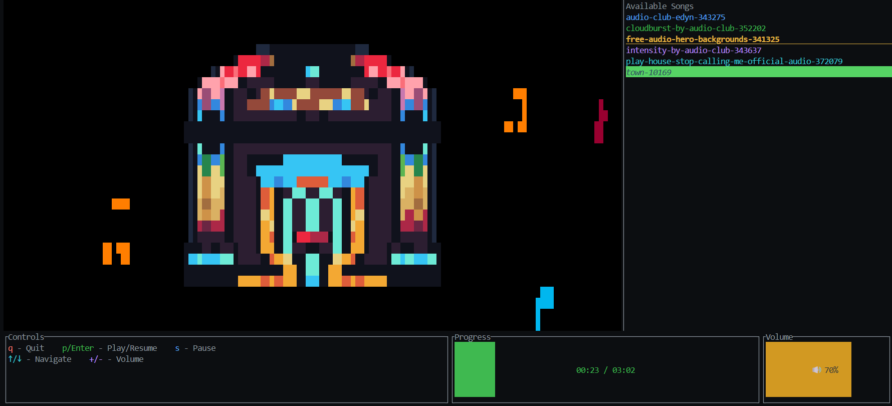

# 🎵 Jukebox CLI

A beautiful terminal-based music jukebox application built with Rust and Ratatui. Features an animated visual interface with floating musical notes and intuitive controls.



## ✨ Features

- 🎶 **Visual Jukebox Interface**: Beautiful background image with animated musical notes
- 📱 **Responsive UI**: Adapts to terminal size with scrollable playlist
- ⏯️ **Full Playback Control**: Play, pause, resume, skip tracks
- 🔊 **Volume Control**: Adjustable volume with visual feedback
- 📊 **Progress Tracking**: Real-time progress bars for song duration and volume
- 🎨 **Colorful Interface**: Each song has its own color in the playlist

## 🚀 Installation

### Prerequisites

- Rust 1.70+ (install from [rustup.rs](https://rustup.rs/))
- Terminal that supports 256 colors and Unicode

### Build from Source

```bash
git clone https://github.com/FedeCarollo/jukebox-cli.git
cd jukebox-cli
cargo build --release
```

## 🎮 Usage

### Basic Usage

```bash
# Use default music directory (example_music)
cargo run

# Specify custom music directory
cargo run -- /path/to/your/music

# Show help
cargo run -- --help
```

### Controls

| Key           | Action                   |
| ------------- | ------------------------ |
| `q`           | Quit application         |
| `p` / `Enter` | Play/Resume current song |
| `s`           | Pause playback           |
| `↑` / `↓`     | Navigate playlist        |
| `+` / `-`     | Adjust volume            |

## 🎨 Interface Layout

```
┌─────────────────────────────┬─────────────────┐
│                             │   📋 Playlist   │
│    🎵 Jukebox Display       │   ♪ Song 1      │
│     (with animated          │   ♫ Song 2      │
│      floating notes)        │   ♬ Song 3      │
│                             │   ...           │
├─────────────────┬───────────┤                 │
│   🎮 Controls   │ 📊 Info   │                 │
│ q-Quit p-Play   │ ▓▓▓░░ 60% │                 │
│ ↑↓-Navigate     │ 🔊 75%    │                 │
└─────────────────┴───────────┴─────────────────┘
```

## 🔧 Features in Detail

### Visual Interface
- **Jukebox Background**: Customizable PNG background that fills the main display area
- **Animated Notes**: Musical note sprites that appear randomly during playback
- **Responsive Layout**: Automatically adjusts to terminal dimensions

### Playlist Management
- **Circular Navigation**: Navigate seamlessly from last to first song and vice versa
- **Auto-advance**: Automatically plays next song when current song ends
- **Visual Indicators**: Selected song is underlined, playing song is highlighted

### Audio Features
- **Format Support**: MP3 files via Symphonia decoder
- **Volume Control**: 0-100% volume with emoji indicators (🔇🔈🔉🔊)
- **Progress Tracking**: Real-time display of current position and total duration

### Performance
- **Efficient Rendering**: Background caching and optimized note generation
- **Responsive Controls**: Non-blocking input handling
- **Memory Management**: Automatic cleanup of expired visual elements

## 🛠️ Technical Details

### Built With
- **Rust**
- **Ratatui**: Terminal UI framework
- **Rodio**: Audio playback library
- **Symphonia**: Audio format decoder
- **Crossterm**: Cross-platform terminal manipulation
- **Image**: Image processing for visual assets

### Architecture
- **Modular Design**: Separated UI components and audio logic
- **State Management**: Centralized jukebox state with canvas rendering
- **Real-time Updates**: Fully handled UI updates with frame rendering

## 📋 Requirements

### System Requirements
- **OS**: Windows, macOS, or Linux
- **Terminal**: Support for 256 colors and Unicode characters
- **Audio**: System audio output capability

### Dependencies
All dependencies are managed by Cargo and will be installed automatically.

## 🖼️ Customizing Visual Assets

### Adding Your Own Jukebox Background

1. **Prepare the Image**:
   - Any image format supported by the `image` crate (PNG, JPEG, GIF, etc.)
   - Recommended: High resolution for better terminal display
   - The image will be automatically resized to fit your terminal

2. **Replace the Background**:
   ```bash
   # Replace the default jukebox background
   cp your-jukebox-image.png img/jukebox.png
   ```

### Adding Custom Musical Notes

1. **Prepare Note Images**:
   - **Format**: PNG files (for transparency support)
   - **Size**: 16x16 pixels (will be randomly resized to 6x6-12x12 during playback)
   - **Transparency**: Use alpha channel for proper note rendering
   - **Content**: Musical note symbols, treble clefs, or any musical imagery

2. **Add Note Images**:
   ```bash
   # Add your custom notes to the notes directory
   cp note-treble.png img/notes/
   cp note-quarter.png img/notes/
   cp note-eighth.png img/notes/
   # ... add as many as you want
   ```

3. **Note Behavior**:
   - All PNG files in `img/notes/` are automatically loaded
   - Notes are randomly selected during playback
   - Each note is randomly resized between 6x6 and 12x12 pixels
   - Transparent pixels are preserved for proper overlay on jukebox background

### Tips for Best Results

- **Jukebox Background**: Use images with good contrast for better text readability
- **Musical Notes**: Create notes with distinct colors for visual variety
- **File Names**: Any valid filename works (e.g., `treble.png`, `quarter-note.png`)
- **Quantity**: Add 5-10 different note designs for good visual variety

### Example Note Collection
```
img/notes/
├── treble-clef.png
├── quarter-note.png
├── eighth-note.png
├── musical-staff.png
└── sharp-symbol.png
```


## 📄 License

This project is licensed under the MIT License - see the [LICENSE](LICENSE) file for details.

## 🙏 Acknowledgments

- Built with the amazing Rust ecosystem
- Inspired by classic jukebox interfaces
- Musical note assets and jukebox imagery

## 🐛 Troubleshooting

### Common Issues

**No songs detected**
- Jukebox-cli supports only mp3 files as of now
- Ensure MP3 files are in the specified directory
- Check file permissions

**Visual artifacts**
- Ensure terminal supports 256 colors
- Try resizing terminal window

**Audio not playing**
- Check system audio settings
- Ensure audio output device is available

**Performance issues**
- Try reducing terminal size

---

*Made with ❤️ and 🎵 in Rust*

### Driving Game Mode

A simple Ratatui-based arcade mini-game that runs alongside the jukebox.

- Controls:
  - W/S: move up/down
  - A/D: move left/right between 3 lanes
  - Space: fire projectile straight up
  - P: pause/resume
  - Esc or Q: exit back to the jukebox UI
  - R: restart when Game Over
  - M: toggle music while gaming (default: on)

- HUD: shows Score, Lives, and Speed (top row inside the game area).
- Enemies spawn at the top and move downward; hit them with projectiles for points.
- Collisions with enemies reduce lives and grant brief invulnerability.
- Game uses a fixed timestep (≈30 Hz) and runs independently of audio playback.

Requirements: 80x24 terminal or larger recommended. Works without any track loaded.
